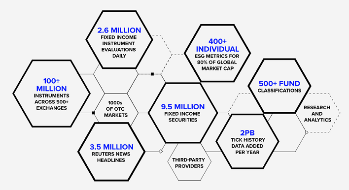

# How to use File Notification Message Distribution with the Client File Store (CFS) Service

## Overview

The Data Platform Client File Store (CFS) Service offers an alternative way to be notified when the new FileSet available through Amazon Simple Queue Service (SQS). The consumers do not need to polling request to fileset API, but continuously monitor the queue and received all required information (including file id) and able to download new file directly through file stream api instead.

This article is the part 2 of the [A Step-By-Step Workflow Guide for RDP Client File Store (CFS) API](https://developers.lseg.com/en/article-catalog/article/a-step-by-step-workflow-guide-for-rdp-client-file-store--cfs--ap) article. This article describes how to use the Data Platform's [Message services delivery API](https://developers.lseg.com/en/article-catalog/article/alerts-delivery-mechanism-in-rdp) to notified consumers (aka subscribers) when the new bulk file is available on the CFS API, and demonstrate with the ready-to-use example tool.

# <a id="whatis_rdp"></a>What is Refinitiv Data Platform (RDP) APIs?

The [Refinitiv Data Platform (RDP) APIs](https://developers.lseg.com/en/api-catalog/refinitiv-data-platform/refinitiv-data-platform-apis) provide various Refinitiv data and content for developers via easy-to-use Web-based API.

RDP APIs give developers seamless and holistic access to all of the Refinitiv content such as Environmental Social and Governance (ESG), News, Research, etc, and commingled with their content, enriching, integrating, and distributing the data through a single interface, delivered wherever they need it.  The RDP APIs delivery mechanisms are the following:
* Request - Response: RESTful web service (HTTP GET, POST, PUT or DELETE) 
* Alert: delivery is a mechanism to receive asynchronous updates (alerts) to a subscription. 
* Bulks:  deliver substantial payloads, like the end-of-day pricing data for the whole venue. 
* Streaming: deliver real-time delivery of messages.

This example project is focusing on the Request-Response: RESTful web service delivery method only.  



For more detail regarding the Refinitiv Data Platform, please see the following APIs resources: 
- [Quick Start](https://developers.lseg.com/en/api-catalog/refinitiv-data-platform/refinitiv-data-platform-apis/quick-start) page.
- [Tutorials](https://developers.lseg.com/en/api-catalog/refinitiv-data-platform/refinitiv-data-platform-apis/tutorials) page.

## <a id="what_is_cfs"></a>What is CFS?

**Client File Store (CFS)** aka File Distribution is a capability of Refinitiv Data Platform (RDP) that provides authorization and enables access to content files stored in publisher-supplied repository. CFS defines content ownership that publisher are isolated. And subscribers can trust the source of content.

CFS is engineered as a self-service metadata tool intend for publishers and subscribers. CFS provides bucket and file-set to organize files to simplify the interaction with publishers or subscribers CFS doesn't store file directly. Actual files are store in publisher-supplied. AWS S3 only one type storage that supported by current CFS.


## <a id="what_is_msd"></a>What is Message Distribution Service?

The Message Distribution Service is a service that allows customers to subscribe to message queue-based interfaces to retrieve non-real-time content changes for all datasets. The Refinitiv Data Platform currently utilizes [AWS SQS](https://aws.amazon.com/sqs/) as a main message queue technology.

Integrated with Client File Store (CFS) Service, message distribution will deliver the message notification for end user clients when the client's interested bulk file is available. 

Note: 
- The equivalent message queue service on [Microsoft Azure](https://azure.microsoft.com/) is [Queue Storage](https://azure.microsoft.com/en-us/products/storage/queues/) service.
- The most equivalent message queue service on [Google Cloud Platform](https://cloud.google.com/) is [Pub/Sub](https://cloud.google.com/pubsub) service.

## <a id="how_file_noti_work"></a>How the File Notification Message Distribution work?

File Notification service lets the clients subscribes for the notification of their interested CFS file (using Bucket names, Package Id, etc) to the RDP Message Distribution Service. Then the clients continuously monitor the queue and received all required information, and able to download new file directly through the RDP file stream api when the file is available.


### File Notification Message Distribution Workflow Step-By-Step

Let's drive into more technical detail about the File Notification Message Distribution workflow. The application steps are as follows:

1. Subscribers make a subscription to API https://api.refinitiv.com/message-services/v1/file-store/subscriptions endpoint by specified CFS content that they interest. E.g. Bucket Name, Package Id, Fileset Attribute.
2. Subscribers received 
    - Subscription ID
    - SQS Endpoint
    - Decryption Key 
3. Subscribers request credential to access the provided SQS.
4. Subscribers continually checking the SQS in short interval and as soon as the new FileSet that matched with the criteria available message will be available in user specific SQS
5. Fetch message from SQS and decrypt the message to see FileSet / File detail
6. Call CFS API to generate the pre-signed URL to download the file.

## File Notification Message Distribution Tools

### <a id="prerequisite"></a>Prerequisite

There is some prerequisite, dependencies, and libraries that the tool is needed.

#### Access to the RDP with the your desire CFS file permission

This project uses RDP access credentials with the CFS file permission. You need both RDP User-ID (email base) and Machine-ID (GE-A-XXXXX) user types.

- **User-ID**: Identifier for user allowing access to contracted content and APIs on the API Playground page (https://apidocs.refinitiv.com/Apps/ApiDocs) or Bulk UI via Workspace/Eikon Desktop. It normally is email address of user (example: sample@lseg.com).
- **Machine ID**:  Identifier for machine allowing access and run this tool or any automate applications. It normally is a username with "GE-A-XXXXXXXX" format.

Please see more detail about how to setup your RDP User-ID and Machine-ID from the [Getting Started with Refinitiv Data Platform](https://developers.lseg.com/en/article-catalog/article/getting-start-with-refinitiv-data-platform) article. 

You can contact your LSEG representative to help you with the RDP account and services.

#### Internet Access

The tool needs to download the required libraries from the https://pypi.org/ Python package repository website. The CFS file is also available on AWS Cloud, so you need internat access to use the tool.

#### Python

This project uses [Python](https://www.python.org/) programming language and runtime. 

The Python [Anaconda](https://www.anaconda.com/distribution/) or [MiniConda](https://docs.conda.io/en/latest/miniconda.html) distribution/package manager is also supported.

### <a id="how_to_run"></a>How to run the application

The first step is to unzip or download the example project folder from [GitHub](https://github.com/LSEG-API-Samples/FileNoti.Message.Distribution.Tools) into a directory of your choice, then set up Python environment based on your preference.

You can download the tool via the following Git command or manual download from the page.

#### Download via Git

Firstly, you need to install Git tool on your machine. You can find more detail about how to install Git from the following resources:
* [Git-SCM website](https://git-scm.com/book/en/v2/Getting-Started-Installing-Git).
* [GitHub Desktop website](https://desktop.github.com/).

Once the installation is succeed, please open a Git Bash tool on the prefer folder and run the following command:

```bash
git clone https://github.com/LSEG-API-Samples/FileNoti.Message.Distribution.Tools.git
```
#### Manual Download

Please open the [https://github.com/LSEG-API-Samples/FileNoti.Message.Distribution.Tools/tree/main](https://github.com/LSEG-API-Samples/FileNoti.Message.Distribution.Tools/tree/main) URL on your prefer web browser, click on the "Code" button and choose "Download ZIP" option.


### <a id="tool_setup"></a>Tool Setup with Python

1. If you didn't have python3.7 or python 3.9 yet please install it via https://www.python.org/downloads/ website
2. You can follow https://wiki.python.org/moin/BeginnersGuide/Download and https://realpython.com/installing-python/ websites for the installation guides.
3. Please verify python version before you proceed the next step (Readme file currently support installation python3.7 and python3.9)
   
      ```bash
      python --version
      ```   
4. Run command to install python libraries
      
      // For python3.7 
      ```bash
      python3 -m pip install -r python37_libs.txt
      ```
      // For python 3.9
      ```bash
      python3 -m pip install -r python39_libs.txt
      ```
5. If you encounter error ModuleNotFoundError: No module named 'Crypto' please follow step below
      // This step is used for python3.7 troubleshooting
      ```bash
      python -m pip uninstall crypto 
      python -m pip uninstall pycrypto
      python -m pip install -r python37_libs.txt
      ```
6. **Go to folder name msg_dist_tools** and open file **credentials.ini** and specify your RDP **Machine-ID credential type** information as follows (If you don't know information please contact your LSEG representative)
      ```ini
      [RDP]
      username = <RDP Machine-ID GE-A-XXXXXXXX>
      password = <RDP Machine-ID password>
      clientId = <RDP App Key>
      ```
      **Caution**: Please **do not** set your RDP User-ID (email) credential type or the same user to access Workspace here.
7. Run Program please check Tool Description section
8. Messages will be stored under metadata/<subscriptionId> folder
9. FileNoti file will be downloaded into your destination folder

### <a id="tool_setup"></a>Tool Setup with Anaconda/MiniConda

1. Download Python [Anaconda](https://www.anaconda.com/distribution/) or [MiniConda](https://docs.conda.io/en/latest/miniconda.html) distribution/package manager and install it in your local machine.
2. Open Anaconda Prompt and go to the project's folder.
3. Run the following command in the Anaconda Prompt application to create a Conda environment named *CFS_FileNoti* for the project.
    ``` bash
    (base) $>conda create --name CFS_FileNoti python=3.9
    ```
4. Once the environment is created, activate a Conda *CFS_FileNoti* environment with this command in Anaconda Prompt.
    ``` bash
    (base) $>conda activate CFS_FileNoti
    ```
5. Run the following command to the dependencies in the *CFS_FileNoti* environment 
    ``` bash
    (CFS_FileNoti) $>pip install -r python39_libs.txt
    ```
6. **Go to folder name msg_dist_tools** and open file **credentials.ini** and specify your RDP **Machine-ID credential type** information as follows (If you don't know information please contact your LSEG representative)
      ```ini
      [RDP]
      username = <RDP Machine-ID GE-A-XXXXXXXX>
      password = <RDP Machine-ID password>
      clientId = <RDP App Key>
      ```
      **Caution**: Please **do not** set your RDP User-ID (email) credential type or the same user to access Workspace here.
7. Run Program please check Tool Description section
8. Messages will be stored under metadata/<subscriptionId> folder
9. FileNoti file will be downloaded into your destination folder

### <a id="tool_run"></a>Tools Running Description

Firstly, you need to set Bucket-name and Package Id (if you have the package Id information) in the json file in the **msg_dist_tools/requestBody** folder.

Example: *singleBucketFilter.json*
```json
{
    "transport": {
        "transportType": "AWS-SQS"
    },
    "query": {
        "bool": {
            "must": [
                {
                    "term": {
                        "payload.FileStoreNotification.fileset.bucketName": "{bucket-name}"
                    }
                },
                {
                    "term": {
                        "payload.FileStoreNotification.fileset.status": "READY"
                    }
                }
            ]
        }
    }
}
```

Example: *singlePackageIdFilter.json*
```json
{
    "transport": {
        "transportType": "AWS-SQS"
    },
    "query": {
        "bool": {
            "must": [
                {
                    "term": {
                        "payload.FileStoreNotification.fileset.packageId": "{package id}"
                    }
                },
                {
                    "term": {
                        "payload.FileStoreNotification.fileset.status": "READY"
                    }
                }
            ]
        }
    }
}
```

Example: *bucketAndPackageIdFilter.json*
```json
{
    "transport": {
        "transportType": "AWS-SQS"
    },
    "query": {
        "bool": {
            "must": [
                {
                    "term": {
                        "payload.FileStoreNotification.fileset.bucketName": "{bucket-name}"
                    }
                },
                {
                    "term": {
                        "payload.FileStoreNotification.fileset.packageId": "{package id}"
                    }
                },
                {
                    "term": {
                        "payload.FileStoreNotification.fileset.status": "READY"
                    }
                }
            ]
        }
    }
}
```

Please contact your LSEG representative about your Bucket-name and Package ID.

The next step is creating a new subscription and specify input json file with the following command:

```bash
python fileNotiMessages.py -c -i requestBody/<json file>
```
Example: I am demonstrating with singleBucketFilter.json and **Test_CFS_BucketTiming** test bucket-name and **4fbb-f1b5-d428da4f-9392-28214215d35a** test package Id as an example data set.

```bash
python fileNotiMessages.py -c -i requestBody/bucketAndPackageIdFilter.json
```
Result:
```bash
log_path log\app.log, log_dir log
log_path log\error.log, log_dir log
Program is started
\ 2024-01-18 18:04:20,861 INFO Successfully get current user: {GE-A-XXXXXXXX}
2024-01-18 18:04:20,861 INFO input parameter = {'get': False, 'create': True, 'poll': False, 'modify': False, 'delete': False, 'subscriptionId': None, 'input': 'requestBody/bucketAndPackageIdFilter.json', 'destinationFolder': None, 'queue': False, 'recovery': False}
2024-01-18 18:04:20,861 INFO

2024-01-18 18:04:20,861 INFO *************************************************************************
2024-01-18 18:04:20,861 INFO ******************* Create new subscription *****************************
2024-01-18 18:04:20,861 INFO *************************************************************************
2024-01-18 18:04:20,861 INFO Request URL: https://api.refinitiv.com/message-services/v1/file-store/subscriptions
2024-01-18 18:04:20,877 INFO Request Body: {'transport': {'transportType': 'AWS-SQS'}, 'query': {'bool': {'must': [{'term': {'payload.FileStoreNotification.fileset.bucketName': 'Test_CFS_BucketTiming'}}, {'term': {'payload.FileStoreNotification.fileset.packageId': '4000-04ea-7d282653-8e6d-810dda18956d'}}, {'term': {'payload.FileStoreNotification.fileset.status': 'READY'}}]}}}
/ 2024-01-18 18:04:22,912 INFO -------------------- Successfully create subscription ----------------------
2024-01-18 18:04:22,928 INFO subscriptionID: b6447a1a-da72-4fbd-b2f5-96185d72eb21
2024-01-18 18:04:22,928 INFO transportEndpoint: https://sqs.us-east-1.amazonaws.com/642157181326/sqs-edsalerts-main-prod-usersqs-b6447a1a-da72-4fbd-b2f5-96185d72eb21
2024-01-18 18:04:22,928 INFO cryptographyKey: iT4kQg+7eQnYhphLN8FbxrfeTXHLGKo0dbHapGm32pQ=
2024-01-18 18:04:22,928 INFO query: {'bool': {'must': [{'term': {'payload.FileStoreNotification.fileset.bucketName': 'Test_CFS_BucketTiming'}}, {'term': {'payload.FileStoreNotification.fileset.packageId': '4000-04ea-7d282653-8e6d-810dda18956d'}}, {'term': {'payload.FileStoreNotification.fileset.status': 'READY'}}]}}
```

The information you need is the **subscriptionID** in the log above. Please copy it for further use.

The next step is polling message queue from existing subscription and specify destination folder using the **subscriptionID** above.

```bash
python fileNotiMessages.py -p -s <subscriptionId> -d <destination folder>
```
Example: 
```bash
python fileNotiMessages.py -p -s b6447a1a-da72-4fbd-b2f5-96185d72eb21 -d C:\msg_dist_python_tools\cfs_download
```

If you want to change the Bucket-name or Package Id, you can update the current **subscriptionID** with the updated JSON file like the following example:


```bash
python fileNotiMessages.py -m -s b6447a1a-da72-4fbd-b2f5-96185d72eb21 -i requestBody/multipleBucketFilter.json
```

**Caution**: If you still want a CFS file, please keep the **subscriptionID** (and update it if you want to change something) until you really want to stop download the CFS file.

If you want to stop download the CFS file, you can delete the subscriptions with the following command:

```bash
python fileNotiMessages.py -u
```
You can find the list of all supported commands from [GitHub](https://github.com/LSEG-API-Samples/FileNoti.Message.Distribution.Tools?tab=readme-ov-file#list-of-supported-commands) repository.

### <a id="troubleshooting"></a>Tools Troubleshooting

**Error**: "'pip' is not recognized as an internal or external command, operable program or batch file." when run a "python3 -m pip install" command.

**Answer**: Your Python installation is not completed. You need to add the path of the pip installation (**{Python installation folder}\Scripts** folder by default) to your PATH system variable. For more detail, please check the following resources:
- https://stackoverflow.com/questions/23708898/pip-is-not-recognized-as-an-internal-or-external-command
- https://builtin.com/software-engineering-perspectives/pip-command-not-found
- https://discuss.python.org/t/pip-not-working/30102

**Error**: "Failed to get access token 400 - {"error":"access_denied"  ,"error_description":"Invalid username or password." }" when running the tool.

**Answer**: This error message means your RDP username or password information in the **msg_dist_tools/credentials.ini** is invalid. Please verify your RDP username (user-id/machine-id) and password.

**Error**: "Failed to get access token 401 - {"error":"invalid_client"  ,"error_description":"Invalid Application Credential." }" when running the tool.

**Answer**: This error message means your RDP App Key information in the **msg_dist_tools/credentials.ini** is invalid. Please verify your RDP App Key.

**Error**: Error with "{"status":403,"message":"Access denied: Insufficient claims to access this resource"}" when running the tool.

**Answer**: This error message means your RDP account does not have permission to access the RDP CFS API for your desire bucket. Please contact your LSEG representative to verify your permission.

## <a id="references"></a>References

That brings me to the end of my File Notification Message Distribution with the CFS Service project. For further details, please check out the following resources:

* [Refinitiv Data Platform APIs page](https://developers.lseg.com/en/api-catalog/refinitiv-data-platform/refinitiv-data-platform-apis) on the [Refinitiv Developer Community](https://developers.lseg.com/) website.
* [Refinitiv Data Platform APIs Playground page](https://apidocs.refinitiv.com/Apps/ApiDocs).
* [Refinitiv Data Platform APIs: Introduction to the Request-Response API](https://developers.lseg.com/en/api-catalog/refinitiv-data-platform/refinitiv-data-platform-apis/tutorials#introduction-to-the-request-response-api).
* [Refinitiv Data Platform APIs: Authorization - All about tokens](https://developers.lseg.com/en/api-catalog/refinitiv-data-platform/refinitiv-data-platform-apis/tutorials#authorization-all-about-tokens).
* [Limitations and Guidelines for the RDP Authentication Service](https://developers.lseg.com/en/article-catalog/article/limitations-and-guidelines-for-the-rdp-authentication-service) article.
* [Getting Started with Refinitiv Data Platform](https://developers.lseg.com/en/article-catalog/article/getting-start-with-refinitiv-data-platform) article.
* [CFS API User Guide](https://developers.lseg.com/en/api-catalog/refinitiv-data-platform/refinitiv-data-platform-apis/documentation#cfs-api-user-guide).


For any questions related to Refinitiv Data Platform APIs, please use the [RDP APIs Forum](https://community.developers.refinitiv.com/spaces/231/index.html) on the [Developers Community Q&A page](https://community.developers.refinitiv.com/).


