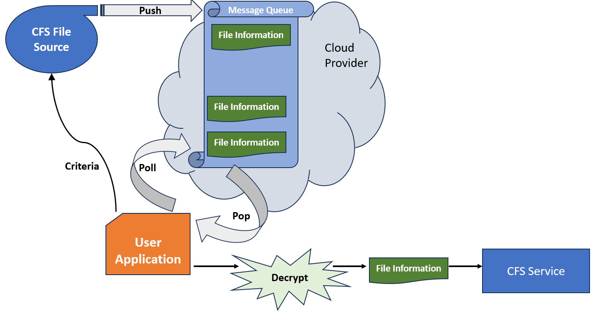
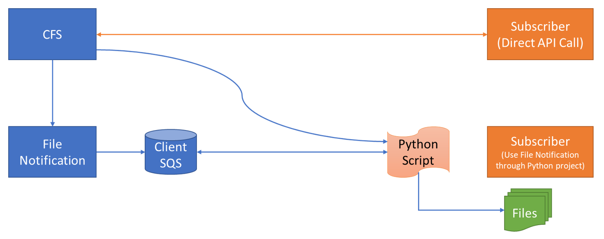

# How to use File Notification Message Distribution with the Client File Store (CFS) Service
- version: 1.0.0
- Last update: January 2023
- Environment: Python
- Prerequisite: [Access to RDP credentials](#prerequisite)

Example Code Disclaimer:
ALL EXAMPLE CODE IS PROVIDED ON AN “AS IS” AND “AS AVAILABLE” BASIS FOR ILLUSTRATIVE PURPOSES ONLY. LSEG MAKES NO REPRESENTATIONS OR WARRANTIES OF ANY KIND, EXPRESS OR IMPLIED, AS TO THE OPERATION OF THE EXAMPLE CODE, OR THE INFORMATION, CONTENT, OR MATERIALS USED IN CONNECTION WITH THE EXAMPLE CODE. YOU EXPRESSLY AGREE THAT YOUR USE OF THE EXAMPLE CODE IS AT YOUR SOLE RISK.

## Overview

The Data Platform Client File Store (CFS) Service offers an alternative way to be notified when the new FileSet available through Amazon Simple Queue Service (SQS). The consumers do not need to polling request to fileset API, but continuously monitor the queue and received all required information (including file id) and able to download new file directly through file stream api instead.

This project is the part 2 of the [A Step-By-Step Workflow Guide for RDP Client File Store (CFS) API](https://developers.lseg.com/en/article-catalog/article/a-step-by-step-workflow-guide-for-rdp-client-file-store--cfs--ap) project. This project describes how to use the Data Platform's [Message services delivery API](https://developers.lseg.com/en/article-catalog/article/alerts-delivery-mechanism-in-rdp) to notified consumers (aka subscribers) when the new bulk file is available on the CFS API, and demonstrate with the ready-to-use example tool.

# What is Refinitiv Data Platform (RDP) APIs?

The [Refinitiv Data Platform (RDP) APIs](https://developers.lseg.com/en/api-catalog/refinitiv-data-platform/refinitiv-data-platform-apis) provide various Refinitiv data and content for developers via easy-to-use Web-based API.

RDP APIs give developers seamless and holistic access to all of the Refinitiv content such as Environmental Social and Governance (ESG), News, Research, etc, and commingled with their content, enriching, integrating, and distributing the data through a single interface, delivered wherever they need it.  The RDP APIs delivery mechanisms are the following:
* Request - Response: RESTful web service (HTTP GET, POST, PUT or DELETE) 
* Alert: delivery is a mechanism to receive asynchronous updates (alerts) to a subscription. 
* Bulks:  deliver substantial payloads, like the end-of-day pricing data for the whole venue. 
* Streaming: deliver real-time delivery of messages.

This example project is focusing on the Request-Response: RESTful web service delivery method only.  

For more detail regarding the Refinitiv Data Platform, please see the following APIs resources: 
- [Quick Start](https://developers.lseg.com/en/api-catalog/refinitiv-data-platform/refinitiv-data-platform-apis/quick-start) page.
- [Tutorials](https://developers.lseg.com/en/api-catalog/refinitiv-data-platform/refinitiv-data-platform-apis/tutorials) page.

## What is CFS?

**Client File Store (CFS)** aka File Distribution is a capability of Refinitiv Data Platform (RDP) that provides authorization and enables access to content files stored in publisher-supplied repository. CFS defines content ownership that publisher are isolated. And subscribers can trust the source of content.

CFS is engineered as a self-service metadata tool intend for publishers and subscribers. CFS provides bucket and file-set to organize files to simplify the interaction with publishers or subscribers CFS doesn't store file directly. Actual files are store in publisher-supplied. AWS S3 only one type storage that supported by current CFS.

## What is Message Distribution Service?

The Message Distribution Service is a service that allows customers to subscribe to message queue-based interfaces to retrieve non-real-time content changes for all datasets. The Refinitiv Data Platform currently utilizes [AWS SQS](https://aws.amazon.com/sqs/) as a main message queue technology.

Integrated with Client File Store (CFS) Service, message distribution will deliver the message notification for end user clients when the client's interested bulk file is available. 

Note: 
- The equivalent message queue service on [Microsoft Azure](https://azure.microsoft.com/) is [Queue Storage](https://azure.microsoft.com/en-us/products/storage/queues/) service.
- The most equivalent message queue service on [Google Cloud Platform](https://cloud.google.com/) is [Pub/Sub](https://cloud.google.com/pubsub) service.

## How the File Notification Message Distribution work?

File Notification service lets the clients subscribes for the notification of their interested CFS file (using Bucket names, Package Id, etc) to the RDP Message Distribution Service. Then the clients continuously monitor the queue and received all required information, and able to download new file directly through the RDP file stream api when the file is available.

### File Notification Message Distribution Workflow Step-By-Step

Let's drive into more technical detail about the File Notification Message Distribution workflow. The consumer (subscriber) application needs to follow though the activities below in order to receive file notification and download CFS file.

1. Subscribers make a subscription to API https://api.refinitiv.com/message-services/v1/file-store/subscriptions endpoint by specified CFS content that they interest. E.g. Bucket Name, Package Id, Fileset Attribute.
2. Subscribers received 
    - Subscription ID
    - SQS Endpoint
    - Decryption Key 
3. Subscribers request credential to access the provided SQS.
4. Subscribers continually checking the SQS in short interval and as soon as the new FileSet that matched with the criteria available message will be available in user specific SQS
5. Fetch message from SQS and decrypt the message to see FileSet / File detail
6. Call CFS API endpoint to generate the pre-signed URL to download the file.

## File Notification Message Distribution Tools

There are [File Notification Message Distribution Tools](https://github.com/LSEG-API-Samples/FileNoti.Message.Distribution.Tools) that do all the above steps and help you download the file to the specified location automatically. 

The Tools are based on full-function Python scripts and require the following prerequisite, dependencies as follows:

### Prerequisite

#### Access to the RDP with the your desire CFS file permission

The tools uses RDP access credentials with the CFS file permission. You need both RDP User-ID (email base) and Machine-ID (GE-A-XXXXX) user types.

- **User-ID**: Identifier for user allowing access to contracted content and APIs on the API Playground page (https://apidocs.refinitiv.com/Apps/ApiDocs) or Bulk UI via Workspace/Eikon Desktop. It normally is email address of user (example: sample@lseg.com).
- **Machine ID**:  Identifier for machine allowing access and run this tool or any automate applications. It normally is a username with "GE-A-XXXXXXXX" format.

Please see more detail about how to setup your RDP User-ID and Machine-ID from the [Getting Started with Refinitiv Data Platform](https://developers.lseg.com/en/article-catalog/article/getting-start-with-refinitiv-data-platform) article. 

You can contact your LSEG representative to help you with the RDP account and services.

#### Internet Access

The tools need to download the required libraries from the https://pypi.org/ Python package repository website. The CFS file is also available on AWS Cloud, so you need internat access to use the tool.

#### Python

The tools uses [Python](https://www.python.org/) runtime. The Python [Anaconda](https://www.anaconda.com/distribution/) or [MiniConda](https://docs.conda.io/en/latest/miniconda.html) distribution/package manager is also supported.

### How to run the Tools

Please follow the step-by-step guide on [GitHub](https://github.com/LSEG-API-Samples/FileNoti.Message.Distribution.Tools?tab=readme-ov-file#how-to-run-the-application) repository.

### Tools Troubleshooting

**Error**: "'pip' is not recognized as an internal or external command, operable program or batch file." when run a "python3 -m pip install" command.

**Answer**: Your Python installation is not completed. You need to add the path of the pip installation (**{Python installation folder}\Scripts** folder by default) to your PATH system variable. For more detail, please check the following resources:
- https://stackoverflow.com/questions/23708898/pip-is-not-recognized-as-an-internal-or-external-command
- https://builtin.com/software-engineering-perspectives/pip-command-not-found
- https://discuss.python.org/t/pip-not-working/30102

**Error**: "Failed to get access token 400 - {"error":"access_denied"  ,"error_description":"Invalid username or password." }" when running the tool.

**Answer**: This error message means your RDP username or password information in the **msg_dist_tools/credentials.ini** is invalid. Please verify your RDP username (user-id/machine-id) and password.

**Error**: "Failed to get access token 401 - {"error":"invalid_client"  ,"error_description":"Invalid Application Credential." }" when running the tool.

**Answer**: This error message means your RDP App Key information in the **msg_dist_tools/credentials.ini** is invalid. Please verify your RDP App Key.

**Error**: Error with "{"status":403,"message":"Access denied: Insufficient claims to access this resource"}" when running the tool.

**Answer**: This error message means your RDP account does not have permission to access the RDP CFS API for your desire bucket. Please contact your LSEG representative to verify your permission.

## Conclusion

That brings me to the end of File Notification Message Distribution with CFS service project. The Message Distribution service is a powerful service that allows consumers to receive content changes notification of non-real-time content from the message queue-based interfaces. Powered by [Amazon SQS](https://aws.amazon.com/sqs/) (*as of January 2024*), developers can create a consumer application to connect to the Service with various programming languages using [AWS SDK](https://aws.amazon.com/developer/tools/). Combined with Client File Store (CFS) service, the File Notification Message Distribution service lets consumers receive notification when the interested CFS file is available and be able to download that file without manually tasks.

At the same time, the [Refinitiv Data Platform (RDP) APIs](https://developers.lseg.com/en/api-catalog/refinitiv-data-platform/refinitiv-data-platform-apis) provide various LSEG data and content for developers via an easy-to-use Web-based API. The APIs are easy to integrate into any application and platform that supports the HTTP protocol and JSON message format. 

## References

That brings me to the end of my File Notification Message Distribution with the CFS Service project. For further details, please check out the following resources:

* [Refinitiv Data Platform APIs page](https://developers.lseg.com/en/api-catalog/refinitiv-data-platform/refinitiv-data-platform-apis) on the [Refinitiv Developer Community](https://developers.lseg.com/) website.
* [Refinitiv Data Platform APIs Playground page](https://apidocs.refinitiv.com/Apps/ApiDocs).
* [Refinitiv Data Platform APIs: Introduction to the Request-Response API](https://developers.lseg.com/en/api-catalog/refinitiv-data-platform/refinitiv-data-platform-apis/tutorials#introduction-to-the-request-response-api).
* [Refinitiv Data Platform APIs: Authorization - All about tokens](https://developers.lseg.com/en/api-catalog/refinitiv-data-platform/refinitiv-data-platform-apis/tutorials#authorization-all-about-tokens).
* [Limitations and Guidelines for the RDP Authentication Service](https://developers.lseg.com/en/article-catalog/article/limitations-and-guidelines-for-the-rdp-authentication-service) article.
* [Getting Started with Refinitiv Data Platform](https://developers.lseg.com/en/article-catalog/article/getting-start-with-refinitiv-data-platform) article.
* [CFS API User Guide](https://developers.lseg.com/en/api-catalog/refinitiv-data-platform/refinitiv-data-platform-apis/documentation#cfs-api-user-guide).

For any questions related to Refinitiv Data Platform APIs, please use the [RDP APIs Forum](https://community.developers.refinitiv.com/spaces/231/index.html) on the [Developers Community Q&A page](https://community.developers.refinitiv.com/).

